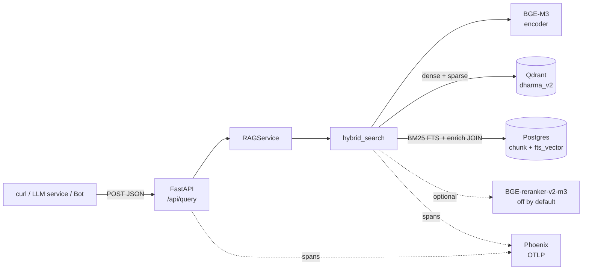
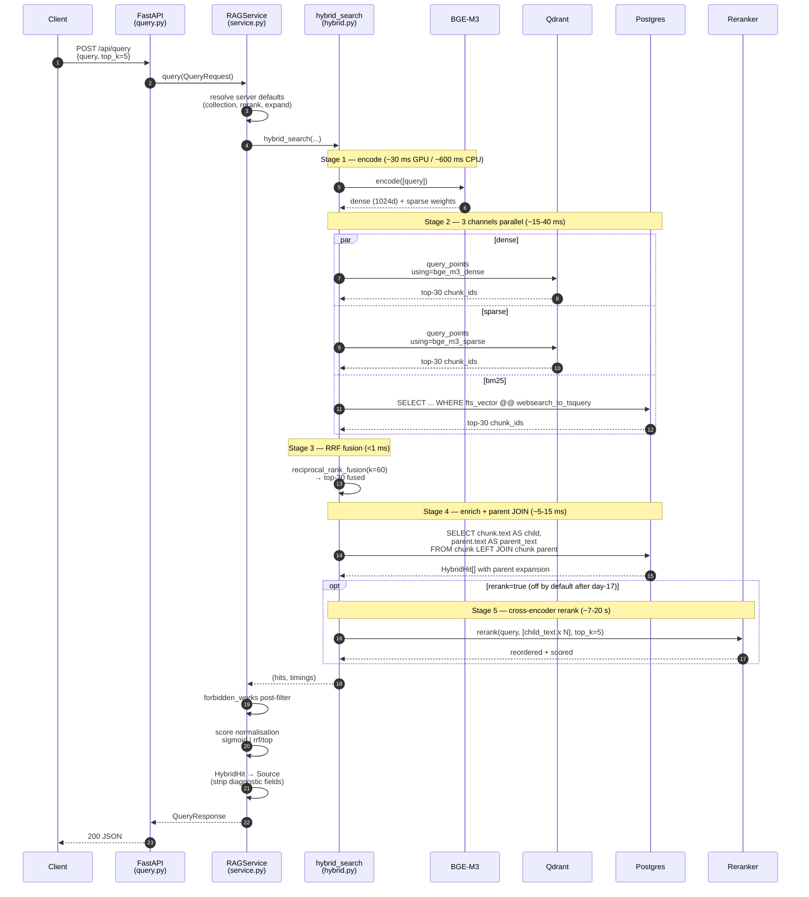

# RAG Pipeline — runtime trace

> Что происходит между `curl POST /api/query` и JSON-ответом.
> Architecture-обзор — в [`ARCHITECTURE.md`](ARCHITECTURE.md), концепты
> отдельных шагов — в [`docs/concepts/INDEX.md`](concepts/INDEX.md).

**Авторитет:** этот файл описывает поведение на день 19 (PR #29). При
изменении пайплайна обновлять синхронно.

---

## Канонический запрос

```bash
curl -X POST http://localhost:8000/api/query \
  -H "Content-Type: application/json" \
  -d '{"query": "what is dukkha?", "top_k": 5}'
```

Ответ:

```json
{
  "query": "what is dukkha?",
  "sources": [
    {
      "work_canonical_id": "sn56.11",
      "segment_id": "sn56.11:5.2",
      "text": "[parent passage ~1.5K tokens — the full Dhammacakkappavattana section]",
      "snippet": "Now this, bhikkhus, is the noble truth of suffering...",
      "score": 0.91
    },
    {
      "work_canonical_id": "mn10",
      "segment_id": "mn10:8.4",
      "text": "[parent passage]",
      "snippet": "...",
      "score": 0.78
    }
    // ... 3 more
  ],
  "latency_ms": 78.3,
  "metadata": {
    "version": "dharma_v2-rerank0-parents1",
    "collection": "dharma_v2",
    "rerank": false,
    "expand_parents": true,
    "n_candidates": 5
  }
}
```

---

## Component view



Каждая стрелка — синхронный вызов в рамках одного request. Нет очередей, нет background jobs. Single-process FastAPI/uvicorn, async DB и async HTTP к Qdrant.

---

## Sequence trace



---

## Stage-by-stage

### Stage 1 — encode

**Span:** `hybrid.encode`
**Атрибуты:** `hybrid.query.len_chars`
**Код:** [src/retrieval/hybrid.py:194-203](../src/retrieval/hybrid.py#L194-L203) → [src/embeddings/bge_m3.py](../src/embeddings/bge_m3.py)

BGE-M3 forward pass, fp16 на CUDA. Возвращает `EncodedBatch(dense=[1024-d], sparse=[{token_id: weight}])`.

| Условие | Latency |
|---|---:|
| GPU (1080 Ti, fp16, model warm) | **~30-50 ms** |
| GPU (cold start) | +1.5 s (model load) |
| CPU fallback | ~600-900 ms |

`query.strip() == ""` короткозамыкает в `([], 0)` без вызова encoder.

### Stage 2 — три канала параллельно

**Span:** `hybrid.channels` (parent), 3 атрибута: `hybrid.dense.hits`, `hybrid.sparse.hits`, `hybrid.bm25.hits`
**Код:** [src/retrieval/hybrid.py:208-232](../src/retrieval/hybrid.py#L208-L232)

Запускаются через `asyncio.gather` — три I/O запроса edinого waiting'а:

| Канал | Куда | Что считает | Top-30 latency |
|---|---|---|---:|
| **dense** | Qdrant `dharma_v2`, `using=bge_m3_dense` | cosine на 1024-d | ~10-25 ms |
| **sparse** | Qdrant `dharma_v2`, `using=bge_m3_sparse` | dot-product на learned sparse | ~8-20 ms |
| **bm25** | Postgres `chunk.fts_vector @@ websearch_to_tsquery` | `ts_rank_cd` | ~5-15 ms |

Итог `channels_s` = max(трёх) ≈ **15-40 ms**.

`per_channel_limit=30` — широкий пул на случай если потом включат reranker. RRF получает три списка по 30.

Концепты: [05 — Qdrant named vectors](concepts/05-qdrant-named-vectors.md), [06 — Postgres FTS](concepts/06-postgres-fts-bm25.md).

### Stage 3 — RRF fusion

**Span:** `hybrid.rrf`
**Атрибуты:** `hybrid.rrf.k=60`, `hybrid.rrf.limit`, `hybrid.rrf.fused`
**Код:** [src/retrieval/rrf.py](../src/retrieval/rrf.py)

Pure-function. Для каждого chunk_id:

```
score = Σ (1 / (k + rank_in_channel))   k=60
```

`limit` — top-N после слияния. Если reranker отключён → `limit=top_k=5` (сразу режем). Если будет работать — `limit=per_channel_limit=30` (даём cross-encoder'у широкий пул).

Latency: **<1 ms**, всё в памяти.

Концепт: [07 — RRF](concepts/07-rrf-hybrid-fusion.md).

### Stage 4 — enrich + parent expansion

**Span:** `hybrid.enrich`
**Атрибуты:** `hybrid.enrich.candidates`, `hybrid.expand_parents`
**Код:** [src/retrieval/hybrid.py:260-265](../src/retrieval/hybrid.py#L260-L265) → `_enrich(...)` ниже

Один SQL round-trip:

```sql
SELECT chunk.id,
       chunk.text       AS child_text,
       parent.text      AS parent_text,
       chunk.parent_chunk_id,
       chunk.segment_id, chunk.is_parent,
       work.canonical_id
FROM chunk
JOIN instance   ON instance.id   = chunk.instance_id
JOIN expression ON expression.id = instance.expression_id
JOIN work       ON work.id       = expression.work_id
LEFT JOIN chunk parent ON parent.id = chunk.parent_chunk_id
WHERE chunk.id IN (:fused_ids)
```

Для каждой строки:
- `parent_text` есть → `HybridHit.text = parent_text`, `child_text = own`, `expanded=True` (small-to-big)
- `parent_text` NULL (top-level chunk) → fallback: `text = child_text = own`, `expanded=False`

Latency: **5-15 ms** — один JOIN, GIN-индекс на PK.

Концепт: [12 — parent/child](concepts/12-parent-child-retrieval.md).

### Stage 5 — rerank (optional, off by default)

**Span:** `hybrid.rerank` (только если `rerank=true`)
**Атрибуты:** `hybrid.rerank.candidates`, `hybrid.rerank.top_k`
**Код:** [src/retrieval/hybrid.py:275-300](../src/retrieval/hybrid.py#L275-L300) → [src/retrieval/reranker.py](../src/retrieval/reranker.py)

BGE-reranker-v2-m3 cross-encoder. Получает **`child_text`** (не parent) — день 17 показал, что reranker деградирует на context-prefixed parent'ах.

Latency на 1080 Ti (Pascal, fp16, 30 кандидатов):
- GPU свободен: ~7 s
- GPU contention (Whisper): ~20 s

Целевая latency по плану была 50-150 ms — **paradox** [`project_dharma_rag_rerank_latency`](../README.md). Включается через `rerank=true` в `/api/retrieve` для A/B; в `/api/query` фигурирует только через server-side default (по умолчанию `False` после дня 17).

Концепт: [10 — reranker](concepts/10-cross-encoder-reranking.md). Парадокс: [11 — Contextual Retrieval](concepts/11-contextual-retrieval.md#reranker-degrades-on-context-prefixed-embeddings).

### Stage 6 — RAGService post-processing

Происходит вне `hybrid_search`, в `RAGService.query`:

| Шаг | Что | Latency |
|---|---|---:|
| `forbidden_works` filter | drop hits where `work_canonical_id ∈ forbidden` | <1 ms |
| Score normalisation | `sigmoid(rerank_score)` или `rrf / top_rrf` | <1 ms |
| HybridHit → Source mapping | strip diagnostic fields | <1 ms |
| PipelineMetadata build | version string, collection, flags, n_candidates | <1 ms |

Концепт: [13 — RAG-service contract](concepts/13-rag-service-contract.md).

---

## Latency breakdown

Production-config (`dharma_v2`, `rerank=False`, `expand_parents=True`), GPU тёплый:

| Stage | Span | Latency | % |
|---|---|---:|---:|
| Encode | `hybrid.encode` | ~40 ms | 50% |
| Channels (parallel) | `hybrid.channels` | ~25 ms | 30% |
| RRF | `hybrid.rrf` | <1 ms | <1% |
| Enrich + JOIN | `hybrid.enrich` | ~10 ms | 12% |
| Rerank | `hybrid.rerank` | 0 (skipped) | 0% |
| Service post-processing | (no span) | ~3 ms | 4% |
| **Total** | — | **~78 ms** | 100% |

Если включить reranker (`rerank=true`): +7-20 s, suma 100× больше. Поэтому production-default — off.

Cold start: первый запрос грузит BGE-M3 (1.5 s) + Qdrant connection pool (50 ms). Разовая стоимость, дальше всё из warm pool.

---

## Phoenix span tree

При включённом tracing'е (`PHOENIX_OTLP_ENDPOINT` set) Phoenix UI показывает дерево:

```
POST /api/query                              ~78 ms     [FastAPIInstrumentor]
├── hybrid.encode                            ~40 ms
│     attrs: hybrid.query.len_chars=18
├── hybrid.channels                          ~25 ms
│     attrs: hybrid.per_channel_limit=30
│            hybrid.dense.hits=30
│            hybrid.sparse.hits=30
│            hybrid.bm25.hits=12
├── hybrid.rrf                               <1 ms
│     attrs: hybrid.rrf.k=60
│            hybrid.rrf.limit=5
│            hybrid.rrf.fused=5
├── hybrid.enrich                            ~10 ms
│     attrs: hybrid.enrich.candidates=5
│            hybrid.expand_parents=true
└── hybrid.rerank   (только если rerank=true)
      attrs: hybrid.rerank.candidates=30
             hybrid.rerank.top_k=5
```

`POST /api/query` — root span от `FastAPIInstrumentor`. `hybrid.*` — children. Вместе они дают полную картину одного запроса.

UI: `http://localhost:6006` (или `phoenix_ui_url` из settings). Концепт: [08 — Phoenix](concepts/08-observability-phoenix.md).

---

## Где смотреть что произошло

| Что нужно | Куда |
|---|---|
| Полное дерево запроса с тайминами | Phoenix UI :6006 → trace tree |
| Latency для одного запроса (без Phoenix) | `response.latency_ms` + endpoint `/api/retrieve` возвращает `timings.{encode_s, channels_s, fusion_s, enrich_s, rerank_s}` |
| Какая collection ответила | `response.metadata.collection` |
| Сколько кандидатов до фильтра | `response.metadata.n_candidates` |
| Запрос что-то вообще нашёл? | `response.sources` empty + `n_candidates == 0` → нулевой recall<br>`sources` empty + `n_candidates > 0` → всё отфильтровал `forbidden_works` |
| Surfaced version | `response.metadata.version` (`dharma_v2-rerank0-parents1`) |
| Структурные логи приложения | stdout/stderr uvicorn — JSON в production, human-friendly в development |

---

## Failure modes

| Симптом | Причина | Где смотреть |
|---|---|---|
| `503 RAG service initialising` | install_query_router не отработал на startup | uvicorn logs, `app.lifespan` |
| `RuntimeError: Retrieval resources not initialised` | install_query_router вызван перед install_retrieve_router | [`src/api/app.py:install_*` order](../src/api/app.py) |
| Latency 30+ s на ровном месте | reranker включился (`rerank=true` или env override) | `response.metadata.rerank` |
| Empty `sources` для очевидного запроса | dharma_v2 collection не существует / пуст | Qdrant: `curl localhost:6333/collections/dharma_v2` |
| BM25 channel всегда 0 hits | `chunk.fts_vector` не сгенерилось — миграция 003 пропущена | `alembic current`, [03 миграция](../alembic/versions/20260423_003_chunk_fts_vector.py) |
| Phoenix не показывает spans | `PHOENIX_OTLP_ENDPOINT=""` или Phoenix не запущен | `docker ps`, `curl localhost:4317` |
| Score выглядит «странно» | Reranker включён → sigmoid(logits), не RRF — другая шкала | `response.metadata.rerank` |
| Cold first request > 2 s | BGE-M3 первая загрузка модели (1.5 GB → GPU) | uvicorn startup log |
| `503 RAG service initialising` после shutdown | Lifespan teardown отработал, app не до конца закрыт | health endpoint должен возвращать 503 |

---

## Альтернативные path'ы

### POST /api/retrieve (внутренний)

Тот же pipeline, но:
- Принимает все диагностические параметры (`rerank: bool | None`, `per_channel_limit`, `expand_parents`)
- Возвращает full `HybridHit` (с `rrf_score`, `per_channel_rank`, `rerank_score`, `parent_chunk_id`)
- Возвращает per-stage `timings` dict

Используется eval-скриптами и smoke. **Surface не frozen** — будет меняться при добавлении новых каналов / weight-tuning.

### Eval flow (offline)

```
scripts/eval_retrieval.py
  └─▶ src/eval/runner.py::run_eval()
        ├─▶ src/eval/golden.py — load golden YAML
        ├─▶ for each QA: hybrid_search(...)
        ├─▶ src/eval/metrics.py — ref_hit@K, MRR
        └─▶ summarise() → docs/EVAL_BASELINE.md / EVAL_CONTEXTUAL_AB.md
```

Тот же `hybrid_search`, но без HTTP/RAGService слоя — eval работает на уровне retrieval engine напрямую, не платит за нормализацию score'ов и mapping в `Source`.

---

## Где это всё в коде

- **Entry:** [src/api/query.py](../src/api/query.py)
- **Service:** [src/rag/service.py](../src/rag/service.py)
- **Orchestrator:** [src/retrieval/hybrid.py](../src/retrieval/hybrid.py)
- **Channels:** [src/retrieval/dense.py](../src/retrieval/dense.py), [src/retrieval/sparse.py](../src/retrieval/sparse.py), [src/retrieval/bm25.py](../src/retrieval/bm25.py)
- **Fusion:** [src/retrieval/rrf.py](../src/retrieval/rrf.py)
- **Reranker:** [src/retrieval/reranker.py](../src/retrieval/reranker.py)
- **Encoder:** [src/embeddings/bge_m3.py](../src/embeddings/bge_m3.py)
- **DB models:** [src/db/models/frbr.py](../src/db/models/frbr.py)
- **Tracing:** [src/observability/tracing.py](../src/observability/tracing.py)
- **Settings:** [src/config.py](../src/config.py)
