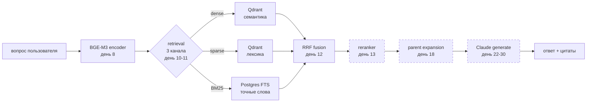

# 01 — RAG pipeline overview

## Что это

**RAG** = **Retrieval-Augmented Generation** = «генерация с подтягиванием
источников». Идея в одном предложении: вместо того, чтобы LLM
галлюцинировал ответ из своего обучения, мы **сначала находим
релевантные отрывки** из проверенного корпуса и **передаём их LLM
вместе с вопросом**, чтобы он отвечал «по бумажке».

Без RAG: «Что Будда сказал о дыхании?» → LLM придумывает ответ из
обрывков, которые он видел в интернете при обучении. Может ошибаться,
не цитирует, не отвечает на родном языке корпуса.

С RAG: «Что Будда сказал о дыхании?» → ищем по 6 478 отрывкам канона →
находим MN 118 «Anāpānassati Sutta» → передаём его LLM → LLM пишет
ответ **с прямой цитатой** и **ссылкой на сутту**.

## Зачем у нас

Буддийский канон — это **миллионы слов в десятках сутт**, многие
переводы расходятся в нюансах, многие термины — Pāli без аналога в
английском. Если бы мы просто спрашивали Claude «что в DN 22?» — он
дал бы общий ответ из своих знаний. Нам нужны **точные цитаты с
указанием конкретных segment-ов** (например, `mn10:12.3`), чтобы
читатель мог пойти на SuttaCentral и проверить.

## Как работает

Pipeline из 6 этапов. Сейчас (день 12) у нас работают первые 5:

(Пунктиром — что ещё не сделано.)

**Что мы сейчас умеем:** `POST /api/retrieve` → возвращает топ-N
отрывков с цитатами и таймингами. **Что не умеем:** генерировать
текстовый ответ. Это работа дней 22-30.

### Этапы простыми словами

1. **Encode** (кодирование) — превращаем вопрос в **вектор** (списки
   чисел), которые компьютер может сравнивать. См. [04 — BGE-M3](04-bge-m3-encoder.md).
2. **Retrieval** (поиск) — три параллельных канала ищут похожие
   отрывки в корпусе:
   - **dense** — по смыслу. См. [05 — Qdrant named vectors](05-qdrant-named-vectors.md).
   - **sparse** — по «словам, которые BGE-M3 считает важными».
   - **BM25** — классический поиск по точным словам через Postgres.
     См. [06 — Postgres FTS](06-postgres-fts-bm25.md).
3. **Fusion** (слияние) — три ранжированных списка объединяем в один
   через **RRF**. См. [07 — RRF](07-rrf-hybrid-fusion.md).
4. **Rerank** (переранжирование) — отдельная LLM-модель смотрит на
   топ-30 кандидатов и пере-сортирует их более точно. День 13.
5. **Parent expansion** — короткий найденный отрывок (child) → достаём
   его «родителя» (parent), большой кусок контекста для LLM. День 18.
6. **Generate** — Claude получает вопрос + parent-отрывки → пишет ответ.

## Альтернативы

- **Без RAG, чистый LLM** — отбросили: галлюцинации, нет цитат, нет
  доверия.
- **Только dense retrieval** — отбросили: на дне 10 увидели, что Pāli
  термины он плохо ловит.
- **Только BM25** — отбросили: на дне 11 увидели, что Sujato
  переводит большинство Pāli терминов в английский, BM25 не находит.
- **Knowledge graph** (Neo4j + LLM на ребрах) — отбросили: для
  буддийского канона ещё нет публичного KG, строить с нуля — год
  работы.

Гибрид (dense + sparse + BM25 + rerank + LLM) — компромисс, который
работает «достаточно хорошо», предсказуемо, и расширяется
покомпонентно.

## Где в коде

- Вход: [src/api/retrieve.py](../../src/api/retrieve.py) — endpoint `POST /api/retrieve`
- Оркестратор: [src/retrieval/hybrid.py](../../src/retrieval/hybrid.py)
- Каналы: `src/retrieval/{dense,sparse,bm25}.py`
- Слияние: [src/retrieval/rrf.py](../../src/retrieval/rrf.py)
- Encoder: [src/embeddings/bge_m3.py](../../src/embeddings/bge_m3.py)
