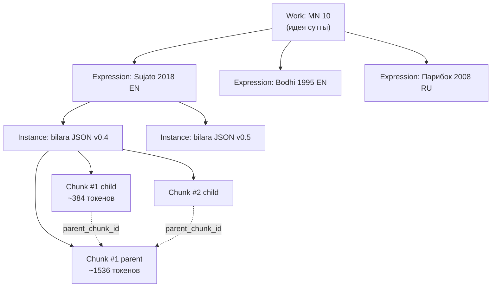

# 02 — FRBR корпусная модель

## Что это

**FRBR** = «Functional Requirements for Bibliographic Records» —
стандарт, придуманный библиотекарями в 1998 году (IFLA), чтобы
правильно классифицировать книги в каталоге. Он отвечает на вопрос:
**«одна и та же ли это книга, если переводы разные?»**

Стандарт делит **«книгу»** на 4 уровня:

| Уровень | Что это | Пример из канона |
|---|---|---|
| **Work** (произведение) | Абстрактная идея, источник | MN 10 «Satipaṭṭhāna Sutta» как идея |
| **Expression** (выражение) | Конкретный перевод/редакция | Sujato 2018, English |
| **Instance** (экземпляр) | Конкретный файл/копия | bilara-data JSON revision X |
| **Chunk** (фрагмент) | Кусок для поиска | один из 15 child-чанков |

## Зачем у нас

Буддийский канон существует **в десятках переводов на десятки языков**.
Бхикху Бодхи, Suttacentral/Sujato, Thanissaro, в России — Парибок,
Сыркин. Все они переводят **одну и ту же сутту**, но **разными
словами**.

Без FRBR-иерархии: каждая сутта в каждом переводе — отдельная запись в
БД. Дубликатов в 50 раз больше, чем нужно. Невозможно сказать «покажи
мне MN 10 во всех переводах» одним SQL-запросом.

С FRBR: одна `Work` = `MN 10`, у неё 5 `Expression` (5 переводчиков),
каждый Expression имеет 1+ `Instance` (если перевод обновился — новый
Instance с новым `content_hash`), каждый Instance разбит на `Chunk`-и
для поиска.

## Как работает

### Конкретный пример

- **Work** `id=uuid-1, canonical_id="mn10", title="Satipaṭṭhāna Sutta"`
- **Expression** `id=uuid-2, work_id=uuid-1, author="sujato", language="eng"`
- **Instance** `id=uuid-3, expression_id=uuid-2, content_hash="abc123", source_url="..."`
- **Chunk** `id=uuid-4, instance_id=uuid-3, sequence=12, text="...", is_parent=false, parent_chunk_id=uuid-5`

Запросы типа:
- «Все переводы MN 10» = `SELECT * FROM expression WHERE work_id = (SELECT id FROM work WHERE canonical_id='mn10')`
- «Перепарсить с обновлённого SuttaCentral» = добавить новый Instance с
  новым content_hash, старый остаётся для воспроизводимости.

## Альтернативы

- **Плоская таблица «sutta»** — отбросили: при добавлении 2-го
  переводчика всё разваливается, миграция на FRBR через год — ад.
- **Только Work + Chunk** — отбросили: теряем информацию о
  переводчике (citation становится анонимной).
- **EAV-модель** (Entity-Attribute-Value) — отбросили: SQL-запросы
  страшнее, JOIN'ов в 3 раза больше.

FRBR — отраслевой стандарт. Пользуется им весь мировой корпус
буддологии (suttacentral.net тоже на ней).

## Тонкость про content_hash

Когда SuttaCentral обновляет HTML — мы **не перезаписываем** старый
Instance. Создаём **новый** с новым `content_hash`. Зачем:
**эмбеддинги привязаны к конкретному тексту**. Если перезатереть текст,
эмбеддинг устаревает молча. С новым Instance можно прогнать ingest
заново для конкретно изменившихся файлов, остальные 99% не трогать.

## Где в коде

- Модели: [src/db/models/frbr.py](../../src/db/models/frbr.py)
- Миграции: [alembic/versions/20260421_001_initial_frbr.py](../../alembic/versions/20260421_001_initial_frbr.py)
- Ingest, который заполняет таблицы: [src/ingest/suttacentral/loader.py](../../src/ingest/suttacentral/loader.py)
