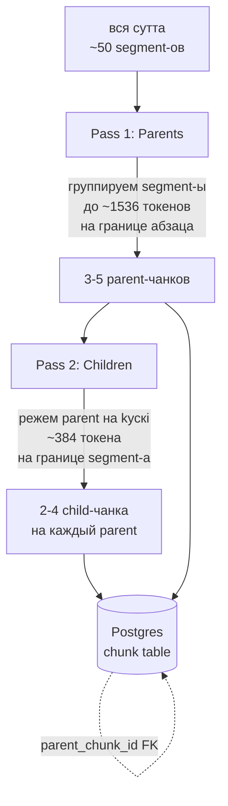

# 03 — Чанкинг parent/child

## Что это

**Чанк** (chunk) — это **кусок текста**, на который мы режем сутту,
чтобы её можно было искать. Поиск работает не «по всей сутте целиком»
(слишком большой контекст), а «по кусочкам».

**Parent/child** означает, что у нас **два уровня нарезки**:

- **Child** — маленький кусок (~384 токена) для **точного поиска**.
  Узкий фокус: одна мысль, одна метафора.
- **Parent** — большой кусок (~1536 токенов) для **передачи LLM**.
  Содержит child + соседний контекст.

Когда retrieval находит child-чанк, мы достаём **его parent**
(отношение `parent_chunk_id` в БД) и **передаём parent** в LLM. LLM
получает богатый контекст, retrieval остаётся точным.

## Зачем у нас

Эксперименты Anthropic (Contextual Retrieval, 2024) показали: для
качества RAG нужны **два разных размера**:

- **Маленький для embedding-поиска** — embedding из 1024 чисел плохо
  «представляет» 2000-токенный кусок (информация размазывается).
  Лучше представляет 384-токенный.
- **Большой для LLM-ответа** — LLM лучше отвечает, когда видит абзац
  целиком, а не фразу из контекста.

Если использовать только один размер — теряем либо точность retrieval,
либо качество ответа. Parent/child даёт обе цели одновременно.

### Конкретный пример из MN 10

```
Parent #5 (1280 токенов): полный раздел о наблюдении за телом
├── Child #5.1 (384 токена): подраздел "feet to head"
├── Child #5.2 (384 токена): подраздел "elements"
└── Child #5.3 (256 токенов): подраздел "cemetery contemplations"
```

Запрос «как наблюдать за телом» → находит Child #5.2 → передаём LLM
**Parent #5 целиком**. LLM видит, что подраздел про elements — часть
большого раздела о теле, понимает контекст.

## Как работает

Двухпроходный алгоритм в `src/processing/chunker.py`:



### Числа из реального запуска

Когда мы прогнали `scripts/rechunk.py` на 3 413 суттах из SuttaCentral:

- **Было** (день 4): 124 532 плоских чанка по segment-у
- **Стало** (день 7): **10 227 структурированных** = **3 749 parent + 6 478 child**

Соотношение child:parent ≈ 1.7 — обычно у parent 1-3 child-а.

## Параметры

| Размер | Цель | Максимум |
|---|---|---|
| Parent | 1 536 токенов | 2 048 (BGE-M3 max input) |
| Child | 384 токена | 512 |

Цифры — компромисс из ADR-0001 после анализа Anthropic Contextual
Retrieval paper (рекомендация 200-400 для child, 1000-2000 для parent).

**Граница parent** — paragraph break (пустая строка между segment-ами).
**Граница child** — segment break (один segment в bilara — это одна
смысловая единица).

## Альтернативы

- **Один размер 512 токенов** (классический подход) — отбросили: либо
  retrieval теряет точность, либо LLM теряет контекст.
- **Размер 1024** — отбросили: BGE-M3 эмбеддинг становится «средним»,
  плохо ловит конкретные понятия.
- **Sliding window** (накладывающиеся chunk-и с overlap 64 токена) —
  отбросили: дубли в результатах retrieval, плюс bilara segment-ы
  уже логически разделены.

## Где в коде

- Алгоритм: [src/processing/chunker.py](../../src/processing/chunker.py)
- Использование при ingest: [src/ingest/suttacentral/loader.py](../../src/ingest/suttacentral/loader.py)
- Backfill для старых данных: [scripts/rechunk.py](../../scripts/rechunk.py)
- Хранение в БД: см. [02 — FRBR](02-frbr-corpus-model.md), таблица `chunk`
