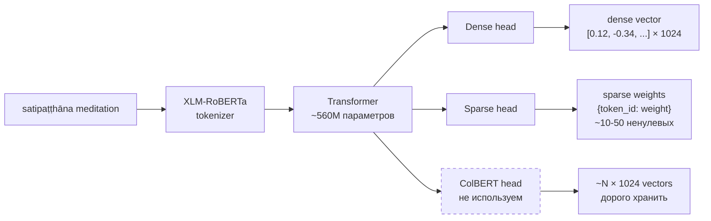

# 04 — BGE-M3 encoder

## Что это

**Encoder** = модель, которая превращает **текст в числа** (вектор), с
которыми компьютер умеет работать. Текст «satipaṭṭhāna» → 1024 числа.
Это называется **embedding** (эмбеддинг, представление).

Главное свойство: **похожие по смыслу тексты дают похожие векторы**.
«mindfulness of breathing» и «awareness of breath» дадут векторы с
**высокой косинусной близостью** (cosine similarity ~0.9), хотя слова
почти не совпадают.

**BGE-M3** — конкретная модель от BAAI (Beijing Academy of AI), 2024
года. Веса — открытые, ~2.3 ГБ. Поддерживает 100+ языков.

## Зачем у нас

Буддийский корпус — **многоязычный**. Нам нужно, чтобы:

1. Запрос на русском («страдание») находил английский текст про dukkha
2. Запрос с диакритикой («satipaṭṭhāna») и без («satipatthana»)
   давали одинаковый результат
3. Из одной forward-pass'а получить **два** независимых сигнала: семантический и лексический

BGE-M3 это всё умеет в одном пакете. Альтернативы (OpenAI ada,
Cohere embed-v3) либо платные (per-query cost), либо англоязычные.

## Как работает

BGE-M3 — это **модифицированный XLM-RoBERTa** (трансформер из 2019),
дообученный на 100+ языках с тремя «головами»:

### Dense vs sparse — что они ловят

| | Dense (плотный) | Sparse (разреженный) |
|---|---|---|
| Размер | 1024 числа | ~50 пар `{token_id: weight}` |
| Ловит | **Семантику.** Синонимы, перефразирование, кросс-язык. | **Лексику.** Какие токены модель считает «важными» в этом тексте. |
| Хорош для | «mindfulness of breathing» → MN 118 | «satipaṭṭhāna» → найдёт документ с этим токеном |
| Слаб для | Редкие термины «размазываются» по 1024 dim | Не понимает синонимов |

Мы **используем оба**, объединяем через RRF (см. [07](07-rrf-hybrid-fusion.md)).

### ColBERT (третья голова) — почему не используем

ColBERT даёт **N × 1024 векторов на чанк** (где N — число токенов).
Хранение: 100× размер dense. Качество retrieval: +5-10%. Цена/отдача
плохая для Phase 1.

## Технические нюансы

- **Lazy loading.** Импорт `BGEM3Encoder()` ничего не качает. Веса
  тянутся с HuggingFace **только** при первом `encoder.encode(...)`.
  Юнит-тесты с mock-моделью никогда не платят за 2.3 ГБ.
- **fp16 на GPU, fp32 на CPU.** Тензорные ядра 1080 Ti не ускоряют
  fp16, поэтому на CPU-runtime принудительно fp32 (см.
  [src/embeddings/bge_m3.py:218](../../src/embeddings/bge_m3.py)).
- **Thread-safe.** Два FastAPI-воркера на старте могут вызвать
  `encode()` одновременно. `threading.Lock` гарантирует, что веса
  загрузятся ровно один раз.
- **Speed.** На 1080 Ti с fp16: ~50 мс на один query encode. На CPU:
  ~200-300 мс. Для batch — линейно: 100 чанков ~5 секунд на GPU.

## Альтернативы

- **OpenAI text-embedding-3-large** — $0.13 за 1M токенов, не работает
  оффлайн. Для нашего корпуса 6478 чанков × ~250 токенов = ~$0.20 на
  один полный re-index. Не критично, но vendor lock-in.
- **Cohere embed-multilingual-v3** — лучшее качество для cross-lingual
  на бенчмарках, но платное и нет sparse-головы.
- **Sentence-Transformers MPNet** — отличное качество для английского,
  но не multilingual.
- **BGE-M3 + Voyage** — Voyage-3 даёт лучшее качество на английском,
  но не делает sparse в одном forward-pass.

BGE-M3 = dense + sparse + multilingual + open-weights в одном
пакете. Phase 1 победитель.

## Где в коде

- Wrapper: [src/embeddings/bge_m3.py](../../src/embeddings/bge_m3.py)
- Использование при индексации: [scripts/index_qdrant.py](../../scripts/index_qdrant.py)
- Использование при retrieval: [src/retrieval/hybrid.py](../../src/retrieval/hybrid.py)
- Smoke test: [scripts/test_bge_m3.py](../../scripts/test_bge_m3.py)
