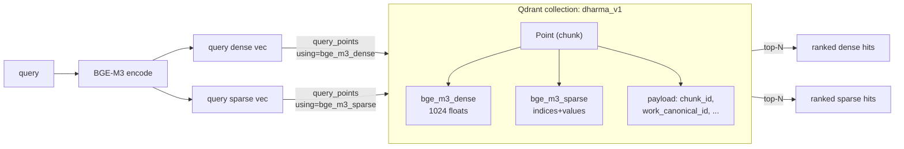

# 05 — Qdrant named vectors

## Что это

**Vector database** (векторная БД) — это не «обычная» БД. Обычный
Postgres хранит строки и ищет по условию (`WHERE x = 1`). Векторная БД
хранит **векторы** (списки чисел) и ищет **похожие** через расчёт
расстояния (cosine, dot, euclidean) — за миллисекунды среди миллионов.

**Qdrant** — конкретная векторная БД, написана на Rust, открытые
исходники (Apache 2.0), популярная в RAG-проектах. Альтернативы:
Pinecone (платный SaaS), Weaviate (Java), Milvus (тяжёлый), pgvector
(Postgres-расширение, медленнее).

**Named vectors** — фишка Qdrant: **на одной записи можно хранить
несколько векторов**, каждый со своим именем. У нас на каждый chunk
лежат **два**:

- `bge_m3_dense` — 1024-dim семантический
- `bge_m3_sparse` — лексический

При запросе указываем, **по какому именно** хотим искать.

## Зачем у нас

Без named vectors было бы **две коллекции**: `dharma_dense` и
`dharma_sparse`. Каждый chunk в обеих, дубликат payload, дубликат id,
сложнее держать в синхроне (что если ingest упал на середине?).

С named vectors — **одна коллекция `dharma_v1`**, одна точка =
один chunk, два вектора рядом. Ingest и query проще.

Заодно фишка **обратимости**: когда придёт BGE-M4 или новая модель,
мы можем добавить **третий** named vector `bge_m4_dense` рядом, не
ломая старое. A/B-тестируем, потом удаляем старый.

## Как работает



### Структура одной точки

```yaml
id: "550e8400-e29b-41d4-a716-446655440000"  # = chunk.id из Postgres
vector:
  bge_m3_dense: [0.12, -0.34, 0.56, ...]  # 1024 числа
  bge_m3_sparse:
    indices: [42, 1024, 7891]              # token IDs
    values: [0.8, 0.5, 0.3]                # их веса
payload:
  chunk_id: "550e8400-..."
  work_canonical_id: "mn10"
  segment_id: "mn10:12.3"
  is_parent: false
  parent_chunk_id: "..."
  sequence: 47
  token_count: 384
```

### Расстояние

Для `bge_m3_dense` мы используем **cosine** (косинусную близость).
Это значит, **направление** вектора важно, а не его длина. У BGE-M3
выходные векторы уже нормализованы, поэтому cosine и dot product
дают идентичный ранкинг — но мы ставим cosine для совместимости с
Qdrant UI.

## Числа из реальной коллекции

После полной индексации (день 10):

- Чанков: **6 478** (только child, parent не индексируем — они для LLM)
- Размер коллекции на диске: **~80 MB**
- Время полной индексации на 1080 Ti с fp16: **4 минуты 40 секунд**
- Latency одного query (top-30): **~10-20 ms** на стороне Qdrant

## Альтернативы

- **pgvector** (vector в Postgres) — отбросили: медленнее на ~3-5×,
  GIN-индекс пока не поддерживает sparse-векторы.
- **Pinecone** — платный SaaS, vendor lock-in.
- **Faiss** (Facebook) — это **библиотека**, не БД. Нет HTTP API, нет
  payload, нет filtering. Использовать в проде — переизобретать БД.
- **Weaviate** — мощный, но Java-стек, тяжёлый docker-образ.

Qdrant = open-source + Rust speed + sparse support + named vectors.

## Что важно знать про прод

- **Persistence:** Qdrant пишет на диск (SQLite-style), переживает
  рестарт docker-контейнера. Volume `qdrant_storage` смонтирован в
  `docker-compose.yml`.
- **Бекап:** snapshot collection — одна команда `client.create_snapshot(...)`.
- **Версия сервера vs клиента:** мы видим warning «client 1.17 vs
  server 1.12» — некритично, но при апгрейде сервера до 1.17 warning
  уйдёт.

## Где в коде

- Создание коллекции и индексация: [src/embeddings/indexer.py](../../src/embeddings/indexer.py)
- CLI для full ingest: [scripts/index_qdrant.py](../../scripts/index_qdrant.py)
- Channel wrappers: [src/retrieval/dense.py](../../src/retrieval/dense.py),
  [src/retrieval/sparse.py](../../src/retrieval/sparse.py)
- Docker config: [docker-compose.yml](../../docker-compose.yml) (service `qdrant`)
- Web UI: http://localhost:6333/dashboard (когда контейнер запущен)
