# 08 — Observability через Phoenix

## Что это

**Observability** (наблюдаемость) — способность **видеть, что
происходит внутри работающего приложения**, без остановки и
дебаггера. Три кита: **traces** (трассы), **metrics** (метрики),
**logs** (логи).

В отличие от **monitoring** (мониторинга) — наблюдаемость нужна для
**отладки незнакомых проблем**. Monitoring отвечает «всё ли в порядке»
(заранее известные алерты). Observability отвечает «**что именно**
сейчас происходит, и почему».

**OpenTelemetry** (OTel) — отраслевой стандарт CNCF (как Kubernetes).
Описывает **формат** трасс/метрик/логов и протокол их передачи (OTLP).
Кто придерживается стандарта — могут менять backend (Phoenix → Jaeger
→ Grafana) без изменения кода приложения.

**Phoenix** — конкретный backend от Arize AI, специально для AI/RAG.
Один docker-контейнер, SQLite на диске, web-UI. Альтернатива
Langfuse'у (тоже AI-observability, но 3 контейнера).

## Зачем у нас

Когда RAG отвечает плохо на конкретный запрос — где причина?

- Encoder сгенерировал плохой вектор?
- Qdrant вернул не то?
- BM25 не нашёл?
- RRF слил неудачно?
- Postgres JOIN потерял текст?

Без трасс мы видим только **итог** (плохой ответ). С трассами видим
**цепочку**: какой вектор был, какие top-N вернул каждый канал, какие
ранги дал RRF, сколько мс ушло на каждый этап.

Это критически важно для **итераций качества** в Phase 2.

## Как работает

### Span и trace простыми словами

- **Span** = одна операция с временными метками (началась в T1,
  закончилась в T2, метаданные).
- **Trace** = дерево spans (корневой span — запрос пользователя,
  дочерние — каждый этап).

Пример trace для одного `/api/retrieve`:

```mermaid
gantt
    title Trace: POST /api/retrieve
    dateFormat X
    axisFormat %L ms

    section HTTP
    POST /api/retrieve              :0, 96

    section Encoding
    BGE-M3 encode (CUDA)            :2, 48

    section Channels (parallel)
    dense_search Qdrant             :50, 30
    sparse_search Qdrant            :50, 28
    bm25 Postgres FTS               :50, 20

    section Fusion
    RRF k=60                        :80, 1

    section Enrich
    Postgres JOIN chunk + work      :81, 11
```



В UI Phoenix это выглядит как **горизонтальный «водопад»** — видно,
что параллельно, что последовательно, где задержка.

### OpenInference

OpenTelemetry **общий** стандарт. **OpenInference** — расширение
конкретно для AI: добавляет **семантические атрибуты** для типичных
RAG-операций (`embedding.text`, `retrieval.documents`,
`llm.input_messages` и т.п.).

Phoenix UI **специально умеет** их рендерить: для embedding-spans
показывает текст, для retrieval-spans показывает найденные chunk-и.
Generic Jaeger показал бы просто «span = embedding», без содержимого.

## Что мы трассируем

Сейчас (день 12):

- ✅ Каждый HTTP-запрос (`FastAPIInstrumentor`)
- ✅ Каждый внешний HTTP-вызов через `httpx` (`HTTPXClientInstrumentor`)
- ✅ SQLAlchemy запросы (с `SQLAlchemyInstrumentor`, если включён)

Что будет добавлено:

- День 13: span на reranker call с input/output
- День 22+: span на LLM call с prompt + completion + token counts
- День 24: метрики стоимости (cost per query)

## Куда смотреть

Phoenix UI **на http://localhost:6006** (когда контейнер запущен через
`docker compose up -d phoenix`).

Главные вкладки:
- **Projects → dharma-rag** — список всех trace
- **Traces** — клик на trace → водопад spans
- **Embeddings** (когда подключим) — UMAP visualization запросов

## Конфигурация

```python
# src/observability/tracing.py
setup_tracing(
    endpoint="http://localhost:4317",  # OTLP/gRPC порт Phoenix
    enabled=True,
    fastapi_app=app,
)
```

Soft-failure: если Phoenix недоступен (dev-машина без docker-compose),
tracing **молча становится no-op**. Production логика не страдает.

## Альтернативы

| Стек | Плюсы | Минусы |
|---|---|---|
| **Phoenix** (наш) | Single-container, OTel-native, AI-aware | Молодой проект, меньше plugin-ов |
| Langfuse | Отличный UI, prompt management | 3 контейнера (web + db + worker) |
| Jaeger + Grafana Tempo | Industry standard, mature | Generic — нет AI-specific UI |
| Honeycomb / DataDog | SaaS, мощные | Платные, vendor lock-in |

Мы переехали с Langfuse на Phoenix в ADR-0001 — single-container и
OTel-native перевесили (см. `docs/decisions/0001-phase1-architecture.md`).

## Тонкости

- **BatchSpanProcessor** буферизует ~30 секунд. На коротком CLI-скрипте
  spans могут не успеть отправиться. Поэтому `shutdown_tracing()` в
  finally — он принудительно flush'ит.
- **FastAPIInstrumentor** должен быть подключён **до первого запроса**.
  Starlette локкает middleware stack после первого request. У нас это
  делается в `create_app()`, **не** в lifespan startup (см. комментарий
  в `src/api/app.py`).

## Где в коде

- Setup: [src/observability/tracing.py](../../src/observability/tracing.py)
- Использование: [src/api/app.py](../../src/api/app.py) — `setup_tracing(fastapi_app=app)`
- Docker config: [docker-compose.yml](../../docker-compose.yml) — service `phoenix`
- Web UI: http://localhost:6006
