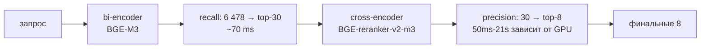

# 10 — Cross-encoder reranking (BGE-reranker-v2-m3)

## Что это

**Reranker** = «второй этап отсева» в нашем retrieval pipeline. Берёт
top-30 кандидатов от RRF (день 12) и пере-ранжирует их более точно
через **другой тип модели** — cross-encoder. Возвращает top-8.

## Bi-encoder vs cross-encoder — главное различие

Это два **разных** способа использовать transformer для retrieval.

### Bi-encoder (что у нас есть в дне 8 — BGE-M3)

Модель кодирует **запрос отдельно** от документов:

```
encode("четыре истины")     → vector_q (1024 числа)
encode("текст MN 118 ...")  → vector_d (1024 числа)
similarity = cos(vector_q, vector_d)
```

Документы можно **закодировать заранее** (мы это сделали в день 10) и
потом за миллисекунды искать любой запрос. Цена скорости —
**грубая оценка**: модель не «видит» запрос и документ в паре.

### Cross-encoder (что добавляем в дне 13 — BGE-reranker-v2-m3)

Модель смотрит на запрос и документ **как на единую строку**:

```
score = model("четыре истины [SEP] текст MN 118 ...")
        ↑ один forward pass на пару
```

Здесь модель **видит** взаимные attention'ы между токенами запроса и
токенами документа. Точнее на 5-15% по бенчмаркам.

**Цена:** на каждую пару `(query, doc)` — отдельный forward pass.
Применять cross-encoder ко всем 6478 чанкам = **~30 минут** на запрос,
неприемлемо.

### Двухступенчатая воронка



Bi-encoder делает **recall** — берёт грубо, но быстро. Cross-encoder
делает **precision** — берёт точно, на маленькой выборке.

## Зачем у нас

День 12 показал: hybrid RRF возвращает разумные top-20, но **не
идеально упорядоченные**. Наш smoke-сравнение day-13:

| Запрос | Топ-1 без rerank | Топ-1 с rerank | Эффект |
|---|---|---|---|
| `mindfulness of breathing` | SN 54.6 | **MN 118** ← поднят с rrf#29 | 🟢 |
| `parable of the raft` | SN 35.238 | **MN 22** | 🟢 |
| `four noble truths` | SN 56.29 | SN 56.29 (стабильно) | = |
| `Anāthapiṇḍika` | SN 2.20 | AN 10.92 | смешано |

«Поднял с rrf#29» — это значит `MN 118 mn118:25.1` стоял на 30-й
позиции в RRF-результате, а после reranker'а попал на 1-ю. Bi-encoder
размазывает релевантные результаты по широкому окну, cross-encoder
выбирает из этого окна лучшее.

## Модель `BAAI/bge-reranker-v2-m3`

- Та же команда BAAI, что сделала BGE-M3 (наш encoder)
- ~568M параметров, ~**1.1 ГБ** весов
- Multilingual (русский запрос против английского документа работает)
- Open weights, не платный API

## Latency на нашем железе

**Реальные замеры** на 1080 Ti с fp16 (smoke-test 10 запросов):

| Стадия | Время |
|---|---|
| encode (BGE-M3) | 50-150 ms |
| 3 channels параллельно | 15-50 ms |
| RRF | <1 ms |
| Postgres enrich (30) | 5-15 ms |
| **Reranker (30 кандидатов)** | **9-21 секунд** ← медленно |
| **Итого с reranker** | **9-22 секунды** |
| Итого без reranker (rerank=false) | 60-200 ms |

**Это значительно медленнее ожидаемого** (план был 50-150 мс).
Возможные причины:
1. FlagEmbedding inference path может не использовать GPU полностью
2. Pascal-архитектура (1080 Ti) без Tensor Cores — fp16 не даёт
   ускорения относительно fp32
3. Длина текста (~400-500 токенов в child-чанке) × 30 кандидатов =
   много токенов через 568M параметров

**На современных GPU (A100, H100) ожидается 10-50× быстрее** = 200-2000ms.

Это backlog'ом — оптимизация latency reranker'а отдельная задача
(batch tuning, проверка реальной fp16 trajectory, возможно onnxruntime).
Функционально pipeline работает — просто медленно.

## API контракт

`POST /api/retrieve` теперь принимает флаг `rerank`:

```json
{
  "query": "mindfulness of breathing",
  "top_k": 8,
  "per_channel_limit": 30,
  "rerank": true  // ← default, можно отключить
}
```

Без reranker'а быстрый ответ для:
- A/B сравнения «как работает без»
- High-throughput режим, где precision не критична
- Eval скрипты на дне 14, чтобы измерить вклад каждого этапа

В ответе поля `rerank_score` и `rrf_rank` показывают:
- На какой позиции этот документ был **до** reranker'а (`rrf_rank`)
- Какой score дал ему cross-encoder (`rerank_score`)

Это помогает понять, что именно reranker «улучшил».

## Параметры

| Параметр | Значение | Где |
|---|---|---|
| Per-channel limit | 30 | bi-encoder recall |
| Reranker top-K | 8 | финальный результат |
| Reranker batch_size | 32 | batch'ей в forward pass |
| Reranker max_length | 1024 | обрезание входа |
| Reranker fp16 | True (на CUDA) | как у encoder'а |

## Альтернативы

- **Cohere Rerank API** — платный SaaS, ~$2/1K queries. Качество чуть выше, но vendor lock-in и ~200 мс per query (медленнее нашего сетевого пути даже на 1080 Ti).
- **Voyage Rerank** — то же самое, платный.
- **mmarco/mxbai-rerank-large** — open-weights, английский только. Не подходит для русских запросов.
- **Без reranker'а (только RRF)** — что у нас было до дня 13. Дешевле, но точность ниже.

`bge-reranker-v2-m3` — open + multilingual + бесплатный. Очевидный выбор для Phase 1.

## Где в коде

- Wrapper: [src/retrieval/reranker.py](../../src/retrieval/reranker.py) (DI-friendly, lazy load, 21 unit-тест)
- Интеграция в pipeline: [src/retrieval/hybrid.py](../../src/retrieval/hybrid.py) (stage 5)
- API параметр `rerank`: [src/api/retrieve.py](../../src/api/retrieve.py)
- Smoke сравнение: [scripts/smoke_rerank.py](../../scripts/smoke_rerank.py)
- Phoenix span: `hybrid.rerank` появится в trace tree, когда reranker запускается

## День 14 — что будет

Reranker создаёт первый «движущийся параметр» pipeline. День 14 запустит
**Ragas eval** на synthetic golden v0.0 **дважды**:

| Версия | Что включено | Цель |
|---|---|---|
| baseline | RRF only | измерить «как было» |
| v1 | RRF + reranker | измерить «насколько помог» |

Разница даст первое **относительное число** качества проекта.
