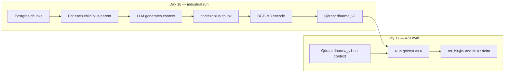

# 11 — Contextual Retrieval

## Что это

**Contextual Retrieval** — метод от Anthropic (август 2024) для улучшения качества поиска через embedding'и. Идея: перед тем как считать векторное представление чанка, к нему **дописывается короткий контекст** (50-100 токенов), сгенерированный LLM, который объясняет «где этот фрагмент живёт в документе». Embedding теперь видит не только сам чанк, но и его роль в источнике.

```
До:    [chunk текст]
После: [LLM-сгенерированный контекст]\n\n[chunk текст]
```

Anthropic репортят: **−49% ошибок ретрива** на их бенчмарке поверх dense + sparse hybrid.

## Зачем у нас

День 14 baseline показал **точное место поломки**:

```
Запрос: "Where did the Buddha first teach the four noble truths?"
Ожидается: sn56.11 (Dhammacakkappavattana — первая проповедь)
Получили: sn56.13, sn56.14, sn56.15, sn56.21, dn16, mn141 — но НЕ sn56.11
```

Embedding-модель видит чанк sn56.11 как «текст про две крайности и средний путь». Десятки других сутт упоминают эти же темы — sn56.11 теряется среди соседей.

После Contextual Retrieval тот же чанк получает префикс типа:

> «This passage is the closing of SN 56.11 (Dhammacakkappavattana Sutta), the Buddha's first sermon delivered at Isipatana to the group of five mendicants…»

Теперь sn56.11 уникально позиционируется в семантическом пространстве — запрос «first teach the four noble truths» геометрически ближе именно к нему.

11/30 запросов в день-14 имели expected sutta в корпусе но не в top-20 — **именно эту дыру** Contextual Retrieval должен закрыть.

## Как работает (наш pipeline)



## Дизайн нашего prompt'а

[`PROMPT_TEMPLATE_V1`](../../src/contextual/contextualizer.py) (день 15, 2026-04-27) требует от LLM:

1. **Sutta canonical ID** (`MN 118`)
2. **Pāli title** если общеизвестен (`Anāpānassati Sutta`)
3. **Локация** в сутте (opening, gradual training, simile of X)
4. **Главная тема** (mindfulness of breathing, four noble truths)
5. **Pāli термины** дословно (`satipaṭṭhāna`, `paṭiccasamuppāda`)

Стиль: один абзац, 50-100 токенов, без markdown, **без перефразирования доктрины**.

## Альтернативы (что не выбрали)

| Альтернатива | Почему не |
|---|---|
| **Hypothetical Document Embeddings (HyDE)** | Генерит «гипотетический ответ», по нему ищет — гениальная идея, но требует LLM на каждый запрос (медленно, дорого). Contextual Retrieval — однократная стоимость на ingest |
| **Query expansion** | Расширяет запрос синонимами через LLM. Помогает, но не решает проблему «sn56.11 vs sn56.13» — там нужны метаданные документа, а не синонимы запроса |
| **Fine-tune embedder** | BGE-M3 fine-tune под Theravada — мощно, но это работа на 5-10 дней + нужен labeled dataset. Phase 2 (день 36-45) |
| **Метаданные как фильтры** | Добавить `Work.canonical_id` в Qdrant payload и фильтровать. Помогает только если пользователь знает sutta ID заранее. Не помогает естественным запросам |

Contextual Retrieval — best ROI: одноразовая стоимость, прирост на любых запросах, не требует переобучения embedder'а.

## Стоимость на нашем масштабе

| Корпус | Chunks | Anthropic Haiku 3.5 + caching | cloud.ru A100 + Qwen 2.5 32B |
|---|---:|---:|---:|
| Текущий (SuttaCentral, 1080 Ti) | 6,478 | ~$15 | ~$8 |
| + dharmaseed talks | ~850,000 | ~$1,800 | ~$830 |

Anthropic выигрывает за счёт **prompt caching** (parent читается один раз на полную цену + 6-7 раз на 10% цены). Cloud.ru выигрывает за счёт ставки за компьют, но без кэша.

Решение «Haiku vs cloud.ru» откладывается на день 16 — обе опции экономически осмысленные.

## Версионирование

`ContextualizedChunk` хранит:
- `prompt_version` (`v1-2026-04-27`) — какой prompt сгенерировал
- `model_id` (`anthropic/claude-haiku-3.5` или `cloudru/qwen2.5-32b`) — какая модель

Это позволит на дне 22+ A/B-тестировать разные provider'ы без полной переиндексации (только тех чанков, у кого версия отличается).

## Где в коде

- [src/contextual/contextualizer.py](../../src/contextual/contextualizer.py) — `PROMPT_TEMPLATE_V1`, `ContextualizedChunk`, `ContextProviderProtocol`, `build_request_messages`, `format_prefixed_chunk`
- [scripts/extract_validation_sample.py](../../scripts/extract_validation_sample.py) — извлечение 50 чанков для валидации
- [docs/contextual/validation_input.md](../contextual/validation_input.md) — 50 sample (parent, child) пар
- [docs/contextual/validation_output_opus_v1.md](../contextual/validation_output_opus_v1.md) — 50 контекстов от Opus 4.7 (валидация prompt v1)
- [tests/unit/contextual/test_contextualizer.py](../../tests/unit/contextual/test_contextualizer.py) — 22 unit-теста на чистые helper'ы

## Provider выбран: OpenRouter

День 16 закрепил выбор провайдера: **OpenRouter** (один API key для многих моделей, включая Anthropic Haiku 3.5). Преимущества над прямым Anthropic:
- Один платежный путь (внутри РФ работает; криптоплатежи поддерживаются)
- Свобода смены модели через переменную окружения `CONTEXT_MODEL` без изменения кода
- На dharmaseed-этапе (Phase 4) можно переключиться на DeepSeek V3 / Gemini Flash без переписывания провайдера

Архитектурно — `OpenRouterProvider` поверх OpenAI-совместимого API. Anthropic-style `cache_control: {"type": "ephemeral"}` пробрасывается прозрачно. Реализация в [src/contextual/providers/openrouter.py](../../src/contextual/providers/openrouter.py).

## Prompt v2 (фикс после смоук-теста)

День 16 первый smoke-run на 5 чанках выявил **систематическую проблему** prompt v1: Haiku галлюцинировал Pāli-имена сутт. Конкретный пример — MN 118 был назван «Satipaṭṭhāna Sutta» (на самом деле это Anāpānassati Sutta; Satipaṭṭhāna — это MN 10 / DN 22).

Prompt v2 явно перечисляет известные пары MN 118 = Anāpānassati, MN 10 = Satipaṭṭhāna, SN 56.11 = Dhammacakkappavattana и инструктирует модель **omit rather than guess** при неуверенности. Версия записывается в `Chunk.context_version` (`v2-2026-04-27`) для будущих миграций.

## Реальная стоимость и время

| Метрика | Прогноз дня 15 | Реальность дня 16 |
|---|---:|---:|
| Стоимость на 6,478 chunks | ~$10 | **~$8** (cap $15) |
| Время прогона sequential | ~6 ч | (не делали) |
| Время prompt cache hit | существенно | **0** (parents <2048 токенов, ниже Haiku-минимума) |
| Время с concurrency=5 | — | **~110 минут wallclock** |

Кэш не сработал: средний parent-chunk у нас ~540 токенов, а Haiku 3.5 требует ≥2048 для caching. На dharmaseed-этапе (где talks дают parents 2000+ токенов) кэш будет работать в полную силу.

## Roadmap

| День | Что |
|---|---|
| **15** ✅ | Prompt v1 валидирован in-chat (50 sample), модуль + DI готов |
| **16** ✅ | OpenRouter provider, prompt v2, миграция 004 (chunk.context_*), industrial run на 6,478 chunks (~$8), переэмбеддинг в `dharma_v2` |
| **17** | A/B golden v0.0 на v1 vs v2, ожидаем +15-30 pp на ref_hit@5 |
| **30+** | Re-prompt iteration если industrial вылез за пределы 50-130 ток |
| **50+ (Phase 4)** | Второй prompt-template для dharmaseed talks (другая доменная специфика — устные речи, lineage учителя, год ретрита) |
